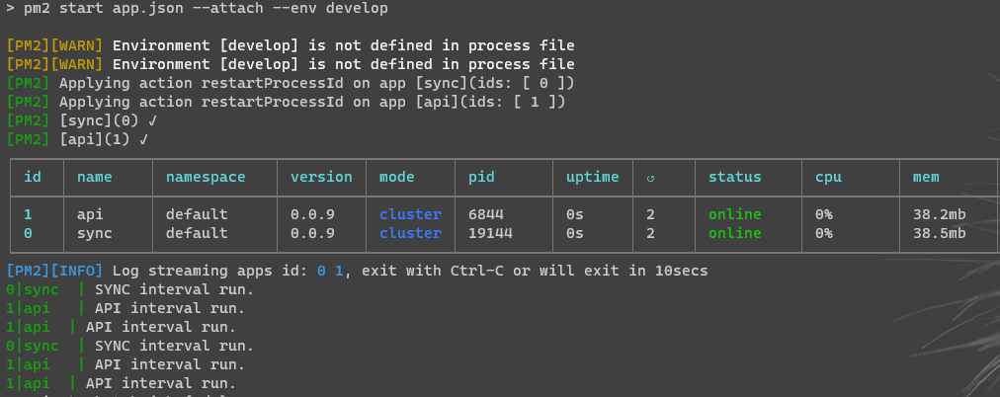

# pm2-issue

Small sample repo that demonstrate an issue with duplicate processes / threads starting for one of two apps.

The two entry points are located under same parent folder, but with "sync" as child folder. They share no code or logic between themselves.

When configured with the current app.json, the output becomes as below, where API is logged two:

